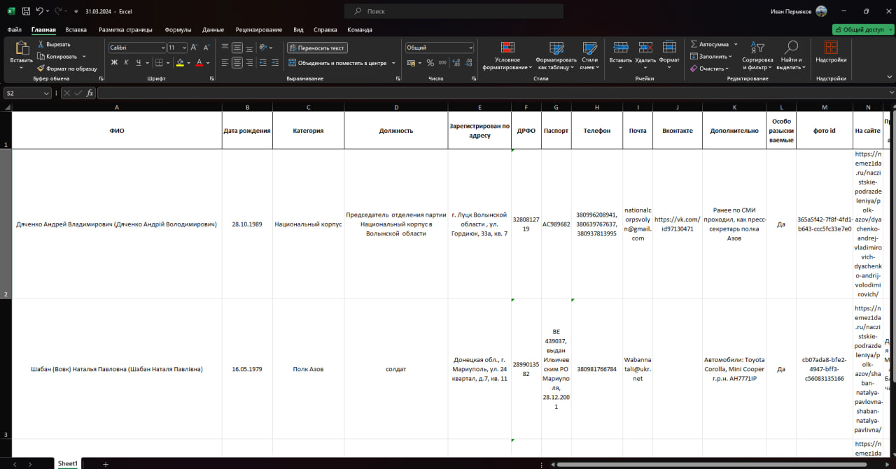
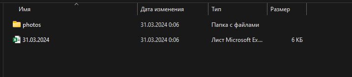
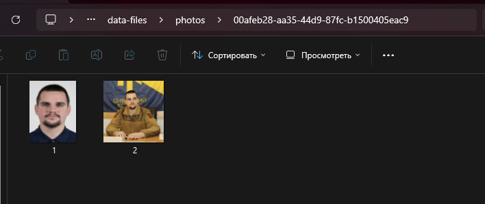
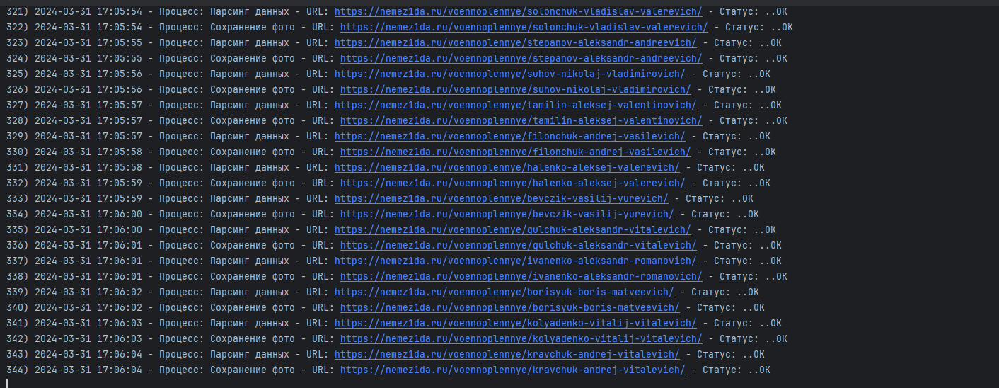

## Скрипт для парсинга сайта [nemez1da.ru](https://nemez1da.ru/)

[Описание](#описание) | [Логирование](#логирование) | [О сайте](https://nemez1da.ru/rahdit-o-nas/)

### Описание:
1. Выполняет парсинг данных с разделов сайта,
рекурсивно проходя все страницы:
> - https://nemez1da.ru/voennoplennye/
> 
> - https://nemez1da.ru/voennye-prestupniki/
> 
> - https://nemez1da.ru/naczistskie-podrazdeleniya/
>
> - https://nemez1da.ru/posobniki/
> 
> - https://nemez1da.ru/inostrannye-posobniki-i-naemniki/
> 
> - https://nemez1da.ru/posobniki/network-terrorists/

2. Сохраняет результат в файле с названием, соответствующем дате запроса с расширением `.xlsx` в папку `data-files/` в виде таблицы следующего формата
> 

Табличное представление

> 

Представление папки /data-files/

3. Сохраняет фотографии в папку `data-files/photos/`, где расположена папка с фотографиями по каждому человеку, название папки соответствует уникальному id, который генерируется для каждого человека и расположен в `.xlsx` файле 
> 

Представление папки /photos/

### Логирование:
Для отслеживания процесса парсинга предусмотрено логирование
> 

Представление логов

